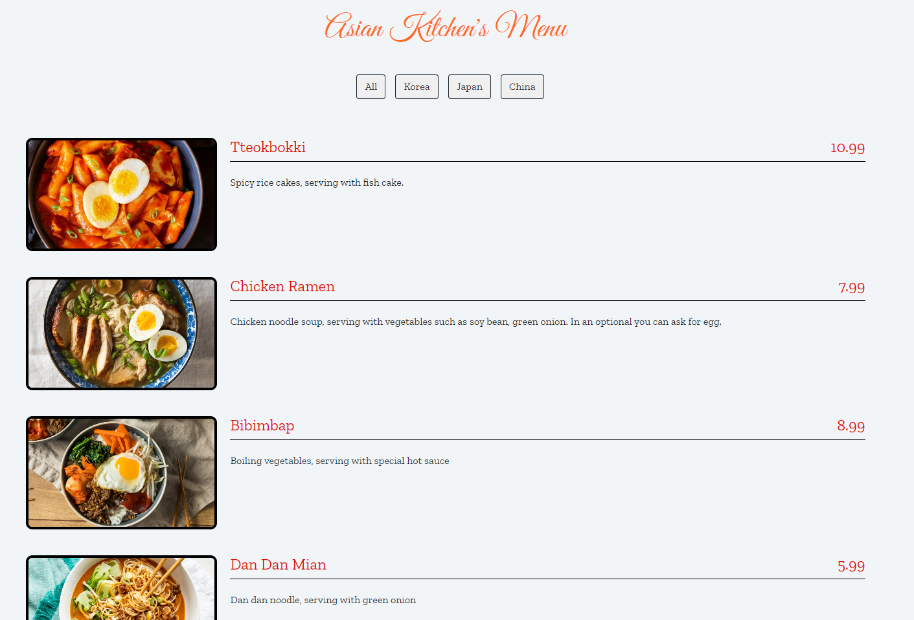

<br/>
<p align="center">
   <a href="https://github.com/FiratCanTas/Vanilla-JavaScript-To-Do-List">
   
  </a>
  <h3 align="center">Restaurant Menu App
</h3>

</p>

      

## About The Project


Nowadays, it has become very common to access the menus of restaurants and cafes with a QR code. This application has a very convenient and user-friendly interface to display any menu content.

## Built With

While developing this project, JavaScript was used as the programming language. It was written in ECMAScript 6 and above standards and developed with a functional programming paradigm. JavaScript DOM manipulation is implemented and CSS3 properties are used for interfaces.

* [JavaScript DOM](https://www.w3schools.com/js/js_htmldom.asp)
* [ECMAScript 6](https://262.ecma-international.org/6.0/#sec-arrow-function-definitions-static-semantics-boundnames)
* [CSS3](https://www.w3schools.com/css/)

## Getting Started

This is an example of how you may give instructions on setting up your project locally.
To get a local copy up and running follow these simple example steps.

### Prerequisites

This is an example of how to list things you need to use the software and how to install them.

* npm

```sh
npm install npm@latest -g
```

### Installation

1. Clone the repo

```sh
git clone https://github.com/FiratCanTas/Vanilla-JavaScript-Restaurant-Menu-App.git
```

. Install NPM packages

```sh
npm install
```

4. Run the project

```JS
npm start
```
